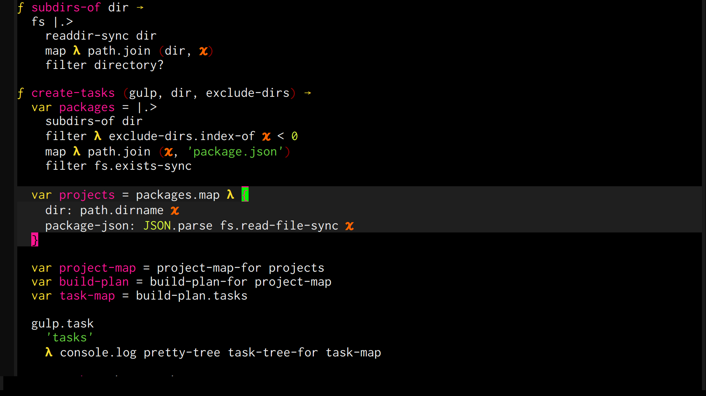

## Metascript Mode

A [Metascript](https://github.com/metascript/metascript) language mode for Emacs.



## Features

1. syntax highlighting with support for nice rendering of lambdas and other constructs
2. flymake integration for checking compilation errors as you type (requires [mjs-check](https://github.com/bamboo/mjs-check) as a dev dependency)
3. simple auto indentation
4. code evaluation and a repl
5. npm test integration with stack trace navigation

## Keyboard shortcuts

* <kbd>M-x metascript-repl</kbd>: Launch a repl.

### metascript buffer

Keyboard shortcut                    | Description
-------------------------------------|-------------------------------
<kbd>C-M-f</kbd> | Move to the next block.
<kbd>C-M-b</kbd> | Move to the previous block.
<kbd>C-M-Space</kbd> | Mark the next block.
<kbd>C-M-x</kbd> | Evaluate active region. Definitions become available in the repl.
<kbd>C-c,</kbd>  | Run the tests.

### metascript test buffer

Usual [compilation-minor-mode](https://www.gnu.org/software/emacs/manual/html_node/emacs/Compilation-Mode.html) shortcuts.

## Installation

```
M-x package-install-file /path/to/metascript-mode.el
```

## Configuration

M-x customize-group metascript-mode

 Have fun!
